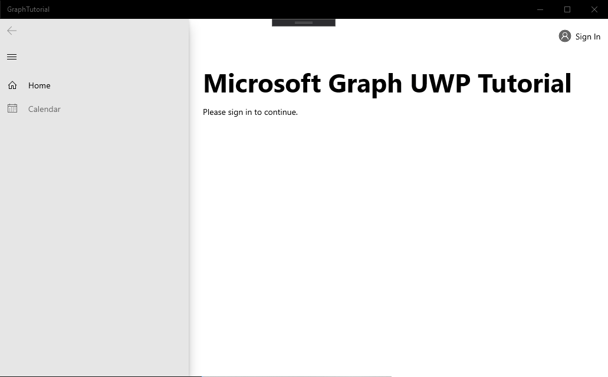

<!-- markdownlint-disable MD002 MD041 -->

このセクションでは、新しい UWP アプリを作成します。

1. Visual Studio を開き、**[新しいプロジェクトの作成]** を選択します。 C# を使用する [**空のアプリ (Universal Windows)** ] オプションを選択し、[**次へ**] を選択します。

    ![Visual Studio 2019 [新しいプロジェクトの作成] ダイアログ](./images/vs-create-new-project.png)

1. [**新しいプロジェクトの構成**] ダイアログで、 `GraphTutorial` [**プロジェクト名**] フィールドにと入力し、[**作成**] を選択します。

    ![Visual Studio 2019 [新しいプロジェクトの構成] ダイアログ](./images/vs-configure-new-project.png)

    > [!IMPORTANT]
    > これらのラボ手順で指定した Visual Studio プロジェクトに対して、まったく同じ名前を入力してください。 Visual Studio プロジェクトの名前が、コードでの名前空間の一部になります。 この手順のコードは、この手順で指定した Visual Studio プロジェクト名に一致する名前空間に応じて異なります。 異なるプロジェクト名を使用する場合には、Visual Studio プロジェクト作成時に入力したプロジェクト名に一致するようにすべての名前空間を調整しないと、コードがコンパイルされません。

1. **[OK]** を選択します。 [**新しいユニバーサル Windows プラットフォームプロジェクト**] ダイアログで、[**最小バージョン**] が [また`Windows 10, Version 1809 (10.0; Build 17763)`はそれ以降] に設定されていることを確認し、[ **OK**] を選択します。

## <a name="install-nuget-packages"></a>NuGet パッケージをインストールする

に進む前に、後で使用する追加の NuGet パッケージをインストールします。

- アプリ内通知とロードインジケーターの UI コントロールを追加するには、 [Microsoft Toolkit](https://www.nuget.org/packages/Microsoft.Toolkit.Uwp.Ui.Controls/)を使用します。
- Microsoft Graph によって返される情報を表示するには、「 [Microsoft Toolkit](https://www.nuget.org/packages/Microsoft.Toolkit.Uwp.Ui.Controls.DataGrid/) 」を参照してください。
- ログインとアクセストークンの取得を処理するための、 [Microsoft Toolkit](https://www.nuget.org/packages/Microsoft.Toolkit.Graph.Controls) 。

1. **[ツール] > [NuGet パッケージ マネージャー] > [パッケージ マネージャー コンソール]** を選択します。 パッケージ マネージャー コンソールで、次のコマンドを入力します。

    ```powershell
    Install-Package Microsoft.Toolkit.Uwp.Ui.Controls -Version 6.0.0
    Install-Package Microsoft.Toolkit.Uwp.Ui.Controls.DataGrid -Version 6.0.0
    Install-Package Microsoft.Toolkit.Graph.Controls -IncludePrerelease
    ```

## <a name="design-the-app"></a>アプリを設計する

このセクションでは、アプリの UI を作成します。

1. 最初に、認証状態を追跡するアプリケーションレベルの変数を追加します。 ソリューションエクスプローラーで **、app.xaml を展開し**、 **App.xaml.cs**を開きます。 次のプロパティを `App` クラスに追加します。

    ```csharp
    public bool IsAuthenticated { get; set; }
    ```

1. メインページのレイアウトを定義します。 を`MainPage.xaml`開き、内容全体を次のように置き換えます。

    :::code language="xaml" source="../demo/GraphTutorial/MainPage.xaml" id="MainPageXamlSnippet":::

    これにより、アプリのメインビューとして機能する、**ホーム**および**予定表**のナビゲーションリンクが含まれる基本的な[navigationview](/uwp/api/windows.ui.xaml.controls.navigationview)が定義されます。 また、ビューのヘッダーに[Loginbutton](https://github.com/windows-toolkit/Graph-Controls)コントロールも追加します。 このコントロールによって、ユーザーはサインインとサインアウトができるようになります。コントロールが完全に有効になっていない場合は、後の手順で構成します。

1. ソリューションエクスプローラーで**グラフ-チュートリアル**プロジェクトを右クリックし、[**新しいアイテムの追加 >**] を選択します。[**空白のページ**] `HomePage.xaml`を選択し、[**名前**] フィールドに「」と入力して、[**追加**] を選択します。 ファイル内の`<Grid>`既存の要素を次のように置き換えます。

    :::code language="xaml" source="../demo/GraphTutorial/HomePage.xaml" id="HomePageGridSnippet" highlight="2-5":::

1. ソリューションエクスプローラーで**MainPage**を展開し、を`MainPage.xaml.cs`開きます。 認証状態を管理するため`MainPage`に、次の関数をクラスに追加します。

    :::code language="csharp" source="../demo/GraphTutorial/MainPage.xaml.cs" id="SetAuthStateSnippet":::

1. この行の`MainPage()` `this.InitializeComponent();` **後**に、次のコードをコンストラクターに追加します。

    ```csharp
    // Initialize auth state to false
    SetAuthState(false);

    // Configure MSAL provider
    // TEMPORARY
    MsalProvider.ClientId = "11111111-1111-1111-1111-111111111111";

    // Navigate to HomePage.xaml
    RootFrame.Navigate(typeof(HomePage));
    ```

    アプリが初めて起動するときに、認証状態がに`false`初期化され、ホームページに移動します。

1. ユーザーがナビゲーションビューでアイテムを選択したときに、要求されたページを読み込むために、次のイベントハンドラーを追加します。

    ```csharp
    private void NavView_ItemInvoked(NavigationView sender, NavigationViewItemInvokedEventArgs args)
    {
        var invokedItem = args.InvokedItem as string;

        switch (invokedItem.ToLower())
        {
            case "calendar":
                throw new NotImplementedException();
                break;
            case "home":
            default:
                RootFrame.Navigate(typeof(HomePage));
                break;
        }
    }
    ```

1. すべての変更を保存し、 **F5**キーを押すか、[デバッグ] を選択して Visual Studio で**デバッグを開始 >** ます。

    > [!NOTE]
    > ご使用のコンピューター (ARM、x64、x86) に適した構成を選択してください。

    
