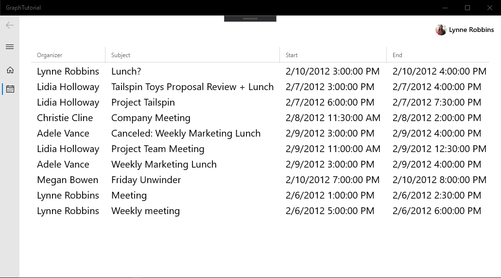

<!-- markdownlint-disable MD002 MD041 -->

この演習では、Microsoft Graph をアプリケーションに組み込みます。 このアプリケーションでは、microsoft [Graph クライアントライブラリ](https://github.com/microsoftgraph/msgraph-sdk-dotnet)を使用して microsoft graph を呼び出すことにします。

## <a name="get-calendar-events-from-outlook"></a>Outlook から予定表のイベントを取得する

最初に、予定表ビュー用の新しいページを追加します。 ソリューションエクスプローラーで**グラフ-チュートリアル**プロジェクトを右クリックし、[**新しいアイテムの追加 >**] を選択します。[**空白のページ**] `CalendarPage.xaml`を選択し、[**名前**] フィールドに「」と入力して、[**追加**] を選択します。

を`CalendarPage.xaml`開き、次の行を既存`<Grid>`の要素の内側に追加します。

```xml
<TextBlock x:Name="Events" TextWrapping="Wrap"/>
```

を`CalendarPage.xaml.cs`開き、次`using`のステートメントをファイルの先頭に追加します。

```cs
using Microsoft.Toolkit.Services.MicrosoftGraph;
using Microsoft.Toolkit.Uwp.UI.Controls;
using Newtonsoft.Json;
```

その後、次の関数を`CalendarPage`クラスに追加します。

```cs
private void ShowNotification(string message)
{
    // Get the main page that contains the InAppNotification
    var mainPage = (Window.Current.Content as Frame).Content as MainPage;

    // Get the notification control
    var notification = mainPage.FindName("Notification") as InAppNotification;

    notification.Show(message);
}

protected override async void OnNavigatedTo(NavigationEventArgs e)
{
    // Get the Graph client from the service
    var graphClient = MicrosoftGraphService.Instance.GraphProvider;

    try
    {
        // Get the events
        var events = await graphClient.Me.Events.Request()
            .Select("subject,organizer,start,end")
            .OrderBy("createdDateTime DESC")
            .GetAsync();

        // TEMPORARY: Show the results as JSON
        Events.Text = JsonConvert.SerializeObject(events.CurrentPage);
    }
    catch(Microsoft.Graph.ServiceException ex)
    {
        ShowNotification($"Exception getting events: {ex.Message}");
    }

    base.OnNavigatedTo(e);
}
```

の`OnNavigatedTo`コードについて考えてみましょう。

- 呼び出し先の URL は`/v1.0/me/events`になります。
- 関数`Select`は、各イベントに対して返されるフィールドを、ビューが実際に使用するものだけに制限します。
- 関数`OrderBy`は、生成された日付と時刻で結果を並べ替えます。最新のアイテムが最初に表示されます。

この予定表ページに移動できるようにするために、アプリを実行する直前に、 `NavView_ItemInvoked` `MainPage.xaml.cs`ファイルのメソッドを次のよう`throw new NotImplementedException();`に変更して行を置換します。

```cs
case "calendar":
    RootFrame.Navigate(typeof(CalendarPage));
    break;
```

これで、アプリを実行し、サインインして、左側のメニューの [**予定表**] ナビゲーション項目をクリックできるようになります。 ユーザーの予定表にあるイベントの JSON ダンプが表示されます。

## <a name="display-the-results"></a>結果を表示する

これで、JSON ダンプを、ユーザーにわかりやすい方法で結果を表示するためのものに置き換えることができます。 の`CalendarPage.xaml`内容全体を次のように置き換えます。

```xml
<Page
    x:Class="graph_tutorial.CalendarPage"
    xmlns="http://schemas.microsoft.com/winfx/2006/xaml/presentation"
    xmlns:x="http://schemas.microsoft.com/winfx/2006/xaml"
    xmlns:local="using:graph_tutorial"
    xmlns:d="http://schemas.microsoft.com/expression/blend/2008"
    xmlns:mc="http://schemas.openxmlformats.org/markup-compatibility/2006"
    xmlns:controls="using:Microsoft.Toolkit.Uwp.UI.Controls"
    mc:Ignorable="d"
    Background="{ThemeResource ApplicationPageBackgroundThemeBrush}">

    <Grid>
        <controls:DataGrid x:Name="EventList" Grid.Row="1"
                AutoGenerateColumns="False">
            <controls:DataGrid.Columns>
                <controls:DataGridTextColumn
                        Header="Organizer"
                        Width="SizeToCells"
                        Binding="{Binding Organizer.EmailAddress.Name}"
                        FontSize="20" />
                <controls:DataGridTextColumn
                        Header="Subject"
                        Width="SizeToCells"
                        Binding="{Binding Subject}"
                        FontSize="20" />
                <controls:DataGridTextColumn
                        Header="Start"
                        Width="SizeToCells"
                        Binding="{Binding Start.DateTime}"
                        FontSize="20" />
                <controls:DataGridTextColumn
                        Header="End"
                        Width="SizeToCells"
                        Binding="{Binding End.DateTime}"
                        FontSize="20" />
            </controls:DataGrid.Columns>
        </controls:DataGrid>
    </Grid>
</Page>
```

これは、 `TextBlock`をに`DataGrid`置き換えます。 を開き`CalendarPage.xaml.cs` 、行を`Events.Text = JsonConvert.SerializeObject(events.CurrentPage);`次のように置き換えます。

```cs
EventList.ItemsSource = events.CurrentPage.ToList();
```

今すぐアプリを実行して予定表を選択すると、イベントの一覧がデータグリッドに表示されます。 ただし、**開始**値と**終了**値は、非ユーザーフレンドリな方法で表示されます。 [値コンバーター](https://docs.microsoft.com/uwp/api/Windows.UI.Xaml.Data.IValueConverter)を使用して、これらの値の表示方法を制御できます。

ソリューションエクスプローラーで**グラフのチュートリアル**プロジェクトを右クリックし、[ **> クラスの追加**] を選択します。クラス`GraphDateTimeTimeZoneConverter.cs`の名前を指定して、[**追加**] を選択します。 ファイルの内容全体を次のように置き換えます。

```cs
using Microsoft.Graph;
using System;

namespace graph_tutorial
{
    class GraphDateTimeTimeZoneConverter : Windows.UI.Xaml.Data.IValueConverter
    {
        public object Convert(object value, Type targetType, object parameter, string language)
        {
            DateTimeTimeZone date = value as DateTimeTimeZone;

            if (date != null)
            {
                // Resolve the time zone
                var timezone = TimeZoneInfo.FindSystemTimeZoneById(date.TimeZone);
                // Parse method assumes local time, which may not be the case
                var parsedDateAsLocal = DateTimeOffset.Parse(date.DateTime);
                // Determine the offset from UTC time for the specific date
                // Making this call adjusts for DST as appropriate
                var tzOffset = timezone.GetUtcOffset(parsedDateAsLocal.DateTime);
                // Create a new DateTimeOffset with the specific offset from UTC
                var correctedDate = new DateTimeOffset(parsedDateAsLocal.DateTime, tzOffset);
                // Return the local date time string
                return correctedDate.LocalDateTime.ToString();
            }

            return string.Empty;
        }

        public object ConvertBack(object value, Type targetType, object parameter, string language)
        {
            throw new NotImplementedException();
        }
    }
}
```

このコードでは、Microsoft Graph によって返された[dateTimeTimeZone](https://developer.microsoft.com/en-us/graph/docs/api-reference/v1.0/resources/datetimetimezone)構造`DateTimeOffset`体を取得し、それをオブジェクトに解析します。 その後、値をユーザーのタイムゾーンに変換し、書式設定された値を返します。

を`CalendarPage.xaml`開き、要素の`<Grid>` **前に**以下を追加します。

```xml
<Page.Resources>
    <local:GraphDateTimeTimeZoneConverter x:Key="DateTimeTimeZoneValueConverter" />
</Page.Resources>
```

次に、その`Binding="{Binding Start.DateTime}"`行を次のように置き換えます。

```xml
Binding="{Binding Start, Converter={StaticResource DateTimeTimeZoneValueConverter}}"
```

行を`Binding="{Binding End.DateTime}"`次のように置き換えます。

```xml
Binding="{Binding End, Converter={StaticResource DateTimeTimeZoneValueConverter}}"
```

アプリを実行し、サインインして、**予定表**のナビゲーションアイテムをクリックします。 **開始**および**終了**の値が書式設定されたイベントの一覧が表示されます。


