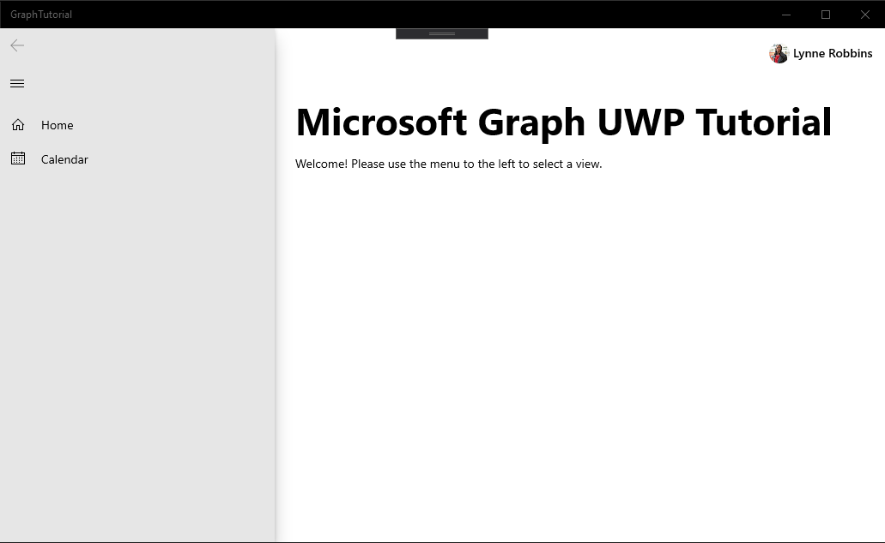

<!-- markdownlint-disable MD002 MD041 -->

<span data-ttu-id="ec907-101">この演習では、Azure AD での認証をサポートするために、前の手順で作成したアプリケーションを拡張します。</span><span class="sxs-lookup"><span data-stu-id="ec907-101">In this exercise you will extend the application from the previous exercise to support authentication with Azure AD.</span></span> <span data-ttu-id="ec907-102">これは、Microsoft Graph を呼び出すために必要な OAuth アクセストークンを取得するために必要です。</span><span class="sxs-lookup"><span data-stu-id="ec907-102">This is required to obtain the necessary OAuth access token to call the Microsoft Graph.</span></span> <span data-ttu-id="ec907-103">この手順では、 [AadLogin](https://docs.microsoft.com/dotnet/api/microsoft.toolkit.uwp.ui.controls.graph.aadlogin?view=win-comm-toolkit-dotnet-stable)コントロールを[Windows コミュニティツールキット](https://github.com/Microsoft/WindowsCommunityToolkit)からアプリケーションに統合します。</span><span class="sxs-lookup"><span data-stu-id="ec907-103">In this step you will integrate the [AadLogin](https://docs.microsoft.com/dotnet/api/microsoft.toolkit.uwp.ui.controls.graph.aadlogin?view=win-comm-toolkit-dotnet-stable) control from the [Windows Community Toolkit](https://github.com/Microsoft/WindowsCommunityToolkit) into the application.</span></span>

<span data-ttu-id="ec907-104">ソリューションエクスプローラーで**グラフのチュートリアル**プロジェクトを右クリックし、[ **Add > New Item...**.] を選択します。[**リソースファイル (. resw)**] を選択し`OAuth.resw` 、ファイルに名前を指定して、[**追加**] を選択します。</span><span class="sxs-lookup"><span data-stu-id="ec907-104">Right-click the **graph-tutorial** project in Solution Explorer and choose **Add > New Item...**. Choose **Resources File (.resw)**, name the file `OAuth.resw` and choose **Add**.</span></span> <span data-ttu-id="ec907-105">Visual Studio で新しいファイルが開いたら、次のように2つのリソースを作成します。</span><span class="sxs-lookup"><span data-stu-id="ec907-105">When the new file opens in Visual Studio, create two resources as follows.</span></span>

- <span data-ttu-id="ec907-106">**Name:**`AppId`, **Value:** アプリケーション登録ポータルで生成されたアプリ ID</span><span class="sxs-lookup"><span data-stu-id="ec907-106">**Name:** `AppId`, **Value:** the app ID you generated in Application Registration Portal</span></span>
- <span data-ttu-id="ec907-107">**Name:**`Scopes`、**値:**`User.Read Calendars.Read`</span><span class="sxs-lookup"><span data-stu-id="ec907-107">**Name:** `Scopes`, **Value:** `User.Read Calendars.Read`</span></span>


> [!IMPORTANT]
> <span data-ttu-id="ec907-109">git などのソース管理を使用している場合は、この時点で、ソース管理`OAuth.resw`からファイルを除外して、アプリ ID が誤ってリークしないようにすることをお勧めします。</span><span class="sxs-lookup"><span data-stu-id="ec907-109">If you're using source control such as git, now would be a good time to exclude the `OAuth.resw` file from source control to avoid inadvertently leaking your app ID.</span></span>

## <a name="configure-the-aadlogin-control"></a><span data-ttu-id="ec907-110">AadLogin コントロールを構成する</span><span class="sxs-lookup"><span data-stu-id="ec907-110">Configure the AadLogin control</span></span>

<span data-ttu-id="ec907-111">最初に、リソースファイルから値を読み取るコードを追加します。</span><span class="sxs-lookup"><span data-stu-id="ec907-111">Start by adding code to read the values out of the resources file.</span></span> <span data-ttu-id="ec907-112">を`MainPage.xaml.cs`開き、次`using`のステートメントをファイルの先頭に追加します。</span><span class="sxs-lookup"><span data-stu-id="ec907-112">Open `MainPage.xaml.cs` and add the following `using` statement to the top of the file.</span></span>

```cs
using Microsoft.Toolkit.Services.MicrosoftGraph;
```

<span data-ttu-id="ec907-113">行を次のコードに置き換えます。</span><span class="sxs-lookup"><span data-stu-id="ec907-113">Replace the `RootFrame.Navigate(typeof(HomePage));` line with the following code.</span></span>

```cs
// Load OAuth settings
var oauthSettings = Windows.ApplicationModel.Resources.ResourceLoader.GetForCurrentView("OAuth");
var appId = oauthSettings.GetString("AppId");
var scopes = oauthSettings.GetString("Scopes");

if (string.IsNullOrEmpty(appId) || string.IsNullOrEmpty(scopes))
{
    Notification.Show("Could not load OAuth Settings from resource file.");
}
else
{
    // Initialize Graph
    MicrosoftGraphService.Instance.AuthenticationModel = MicrosoftGraphEnums.AuthenticationModel.V2;
    MicrosoftGraphService.Instance.Initialize(appId,
        MicrosoftGraphEnums.ServicesToInitialize.UserProfile,
        scopes.Split(' '));

    // Navigate to HomePage.xaml
    RootFrame.Navigate(typeof(HomePage));
}
```

<span data-ttu-id="ec907-114">このコードでは、の`OAuth.resw`設定を読み込み、その値を`MicrosoftGraphService`使用してのグローバルインスタンスを初期化します。</span><span class="sxs-lookup"><span data-stu-id="ec907-114">This code loads the settings from `OAuth.resw` and initializes the global instance of the `MicrosoftGraphService` with those values.</span></span>

<span data-ttu-id="ec907-115">次に、 `SignInCompleted` `AadLogin`コントロールにイベントのイベントハンドラーを追加します。</span><span class="sxs-lookup"><span data-stu-id="ec907-115">Now add an event handler for the `SignInCompleted` event on the `AadLogin` control.</span></span> <span data-ttu-id="ec907-116">`MainPage.xaml`ファイルを開き、既存`<graphControls:AadLogin>`の要素を次のように置き換えます。</span><span class="sxs-lookup"><span data-stu-id="ec907-116">Open the `MainPage.xaml` file and replace the existing `<graphControls:AadLogin>` element with the following.</span></span>

```xml
<graphControls:AadLogin x:Name="Login"
    HorizontalAlignment="Left"
    View="SmallProfilePhotoLeft"
    AllowSignInAsDifferentUser="False"
    SignInCompleted="Login_SignInCompleted"
    SignOutCompleted="Login_SignOutCompleted"
    />
```

<span data-ttu-id="ec907-117">その後、で`MainPage` `MainPage.xaml.cs`クラスに次の関数を追加します。</span><span class="sxs-lookup"><span data-stu-id="ec907-117">Then add the following functions to the `MainPage` class in `MainPage.xaml.cs`.</span></span>

```cs
private void Login_SignInCompleted(object sender, Microsoft.Toolkit.Uwp.UI.Controls.Graph.SignInEventArgs e)
{
    // Set the auth state
    SetAuthState(true);
    // Reload the home page
    RootFrame.Navigate(typeof(HomePage));
}

private void Login_SignOutCompleted(object sender, EventArgs e)
{
    // Set the auth state
    SetAuthState(false);
    // Reload the home page
    RootFrame.Navigate(typeof(HomePage));
}
```

<span data-ttu-id="ec907-118">最後に、ソリューションエクスプローラーで、[**ホームページ**] を`HomePage.xaml.cs`展開し、を開きます。</span><span class="sxs-lookup"><span data-stu-id="ec907-118">Finally, in Solution Explorer, expand **HomePage.xaml** and open `HomePage.xaml.cs`.</span></span> <span data-ttu-id="ec907-119">行の`this.InitializeComponent();`後に次のコードを追加します。</span><span class="sxs-lookup"><span data-stu-id="ec907-119">Add the following code after the `this.InitializeComponent();` line.</span></span>

```cs
if ((App.Current as App).IsAuthenticated)
{
    HomePageMessage.Text = "Welcome! Please use the menu to the left to select a view.";
}
```

<span data-ttu-id="ec907-120">アプリを再起動し、アプリの上部にある [**サインイン**] コントロールをクリックします。</span><span class="sxs-lookup"><span data-stu-id="ec907-120">Restart the app and click the **Sign In** control at the top of the app.</span></span> <span data-ttu-id="ec907-121">サインインしたら、UI が変更され、サインインに成功したことを示します。</span><span class="sxs-lookup"><span data-stu-id="ec907-121">Once you've signed in, the UI should change to indicate that you've successfully signed-in.</span></span>



> [!NOTE]
> <span data-ttu-id="ec907-123">この`AadLogin`コントロールは、アクセストークンの格納と更新のロジックを実装します。</span><span class="sxs-lookup"><span data-stu-id="ec907-123">The `AadLogin` control implements the logic of storing and refreshing the access token for you.</span></span> <span data-ttu-id="ec907-124">トークンは、セキュリティで保護されたストレージに格納され、必要に応じて更新されます。</span><span class="sxs-lookup"><span data-stu-id="ec907-124">The tokens are stored in secure storage and refreshed as needed.</span></span>